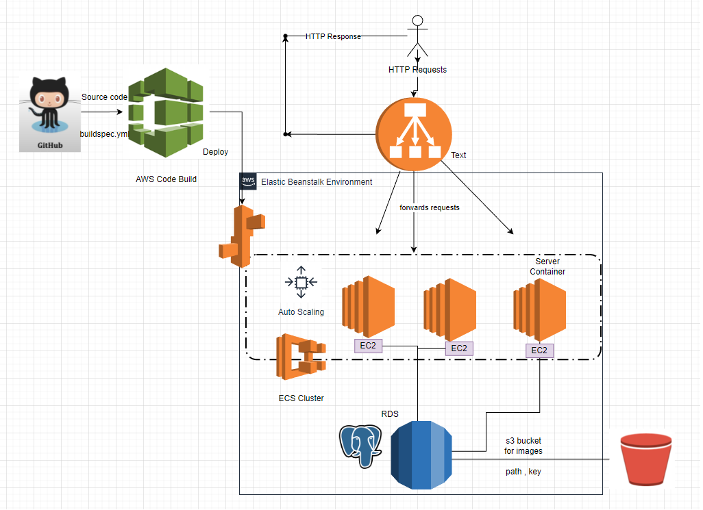
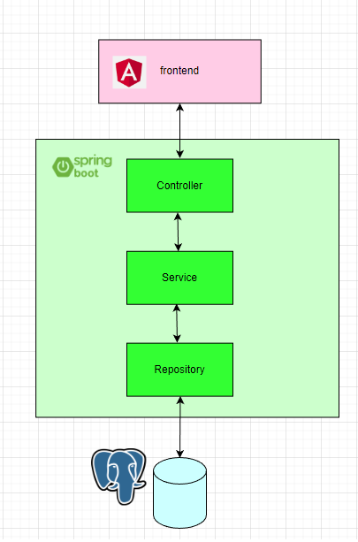

# Revature: Project3 "RevBook"

<b>PROJECT STATUS</b>: IN-PROGRESS

<b>Group Name</b>:

&emsp;Rory's Team

<b>Group Members</b>:

&emsp;John Hedler, Asad Nayani, Ben Castilla, Benjamin Johnson, Chandresh Ahir, Chris "Clyde" Christian, Dae Hyun Kim, Daniel Heck, Daniel T Tewoldebrhan, David Timothy, Goran Markovic, Haruya Maeda, Kyle Weiding, MD Zaman, Nicholas Olshansky, Priyanka Vemuri, Rich Chan, Ryan Oxley, Valentina Genty

<b>Project3 Name</b>:

&emsp;RevBook

<b>Project3 Description</b>:

&emsp;The project consists of a fully functional social media website where users can sign up and post whatever their heart desires. Users will be able to create posts where text can be inserted, as well as pictures and video. Users can like, comment, and/or share other users posts.

#

## Project User Stories:
1) Users can register a new account.
2) Users can sign in.
3) ...

#

## Technologies Used:
1)	Java
2)	Spring Boot
3)	Spring JPA (Hibernate)
4)	Spring Security
5)	Angular
6)	TypeScript/JavaScript
7)	HTML & CSS
8)	Bootstrap
9)	PostgreSQL / JDBC
10)	Amazon Web Services – Relational Database
11) Amazon Web Services - S3 Bucket
12)	H2 Database
13)	Postman
14)	DBeaver
15)	IntelliJ IDE
16)	Git / GitHub

### Project Build Architecture

### N Tier Web Application

