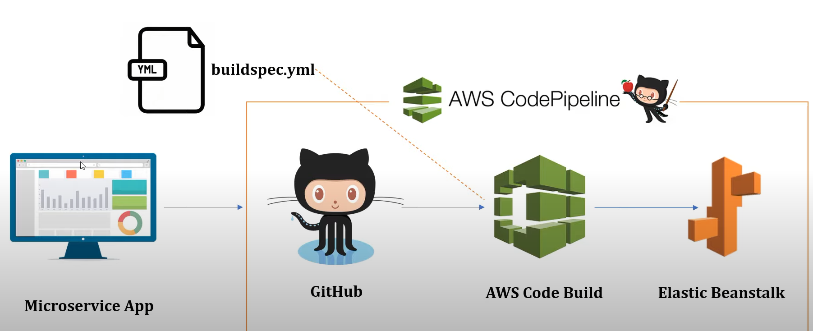

# Prerequisites for the Project
### Back-end
- AWS S3 bucket to store the images. Make sure that `permission` is set to public
- AWS S3 bucket to store **`application.properties`** file. You would only need this build and deploy the project on `AWS EBS`, but if you are planning to run the project on your local env, you would not need it. 
- AWS RDS (Postgres) 
- AWS Access and Secret key
- Java version 11. It is important to use version 11 for build since we will be using `Java Corretto 11` platform for `Elastic Beanstalk Environment`. A mismatch can result in   
- Your favorite IDE for JAVA development

### Front-end
- Node. We will use it for mostly NPM related commands. 
- Angular. [@angular/cli](https://angular.io/guide/setup-local) 
- Visual Studio Code. [VSCode](https://code.visualstudio.com/)  


# Setting up the Back-end
## Running the project on Local Environment
- To run the project on local environment, you would need `application.properties` inside the resources directory of both `test` and `main` env.

### `main`
- You can use the following template for `application.properties` file
```properties
# Preferable 5000 for EBS deployment
server.port=5000

#Accepted Max Image Size. 
spring.servlet.multipart.max-file-size=10MB

# Postgres Configuration:
spring.jpa.properties.hibernate.dialect = org.hibernate.dialect.PostgreSQLDialect
spring.jpa.hibernate.ddl_auto=update
spring.jpa.hibernate.show-sql=true

# AWS PostgreSQL Database Config
spring.datasource.url=jdbc:postgresql://<***rds endpoint***>/postgres
spring.datasource.username=
spring.datasource.password=

# Amazon S3 Bucket Config to store images
s3_accessKey=
s3_secretKey=
s3_region=
```

### `test`
- You can use the following template for `application.properties` file

```properties
#Accepted Max Image Size. 
spring.servlet.multipart.max-file-size=10MB

# Postgres Configuration:
spring.jpa.properties.hibernate.dialect = org.hibernate.dialect.PostgreSQLDialect
spring.jpa.hibernate.ddl_auto=update
spring.jpa.hibernate.show-sql=true

# Test Database with H2:
spring.h2.console.enabled=true
spring.datasource.url=jdbc:h2:mem:test
spring.datasource.driverClassName=org.h2.Driver
spring.datasource.username=admin
spring.datasource.password=password
spring.jpa-database-platform=org.hibernate.dialect.H2Dialect

# Amazon S3 Bucket Config to store images
s3_accessKey=
s3_secretKey=
s3_region=
```

### `database foreign keys`

- This step is optional, but you can use in the Command-Line or DBeaver's Script file to update the database to ensure the tables have the proper foreign keys:
```markdown
alter table comment add foreign key (post_id) references post(post_id) on delete cascade on update cascade;

alter table vote_comment add foreign key (comment_id) references comment(comment_id) on delete cascade on update cascade;
alter table vote_comment add foreign key (voter_id) references users(user_id) on delete cascade on update cascade;

alter table vote_post add foreign key (post_id) references post(post_id) on delete cascade on update cascade;
alter table vote_post add foreign key (voter_id) references users(user_id) on delete cascade on update cascade;

alter table post_image add foreign key (post_id) references post(post_id) on delete cascade on update cascade;

alter table sub_comment add foreign key (comment_id) references comment(comment_id) on delete cascade on update cascade;
```

## Using `AWS CodePipeLine` to build and deploy the project



- You can read the [**article**](https://docs.aws.amazon.com/codebuild/latest/userguide/sample-elastic-beanstalk.html) to learn how to use `Codebuild` and `CodePipeLine`, we will be using the **Scenario B: Use CodePipeline to run CodeBuild and deploy to Elastic Beanstalk** 
- `buildspec.yml` and `.ebextensions` are already in the ROOT for your convenience. You would need to make small changes to `buildspec.yml` file. 
- Follow the steps provided in the article. However, we would need to perform some supplemental steps to deploy the project.
### Supplemental Steps
- To run the project, you would need two `application.properties` files. One for the `main` env and other for the `test` env. We will store those files on s3 bucket.
- You can use the above template to create `application.properties` files.
- Once you have it, you would need to create a `AWS S3 Bucket` and store the files in their respective folders. Like so:
```
s3bucketName/main/application.properties
s3bucketName/test/application.properties
<!-- the bucket is just a placeholder -->
``` 
- These will be used while building the code and `buildspec.yml` has the location of the s3 bucket in the `pre-build` section
### *`buildspec.yml`*
```yml
 pre_build:
    commands:
      - echo ======================Pre build ==================
      - pwd
      - ls -al
      - ls -al ./src/main/resources/
      - aws s3 cp s3://s3bucketName/main/application.properties ./src/main/resources/application.properties
        #replace the s3bucketName with the name of the bucket you made
      - ls -al ./src/main/resources/
      - ls -al ./src/test/resources/
      - aws s3 cp s3://s3bucketName/test/application.properties ./src/test/resources/application.properties
        #replace the s3bucketName with the name of the bucket you made
      - ls -al ./src/test/resources/
```
- The `s3bucketName` above is just a placeholder. You would need to change this with the actual bucket name inside the `buildspec.yml` file 

### Configuring the s3 buckets to allow access to read `application.properties`
- Since the application needs access to the s3 bucket, make sure that the s3 bucket `permission` is set to public in the `Block public access (bucket settings)`
- Also, just below this, you can see `Bucket policy` section. Click Edit button on the right and paste the following policy 
```json
{
	"Version": "2012-10-17",
	"Id": "Policy1655062824513",
	"Statement": [
		{
			"Sid": "Stmt1655062822179",
			"Effect": "Allow",
			"Principal": "*",
			"Action": "s3:GetObject",
			"Resource": "arn:aws:s3:::s3bucketName/*"
            // replace the s3bucketName with the bucketName
		}
	]
}
```
- This will allow the Codebuild to access the `application.properties` during the `Codebuild`
- Once the `CodeBuild` is complete and the PipeLine moves towards the deployment, you can **should** change the permission of the bucket to block public access and simply delete the Bucket Policy. Keeping this information public can be detrimental.

# Setting up the front-end
- The angular project for RevBook is in the frontend directory.
- Change the directory to frontend and inside the command prompt, run `npm install`
- This will install all the necessary libraries/dependencies.
- After the installation is complete. run `ng serve` inside the command prompt.
- This will serve the project to your `locahost:4200`
- Inside the browser, type `http://localhost:4200/` to see the Angular Project


